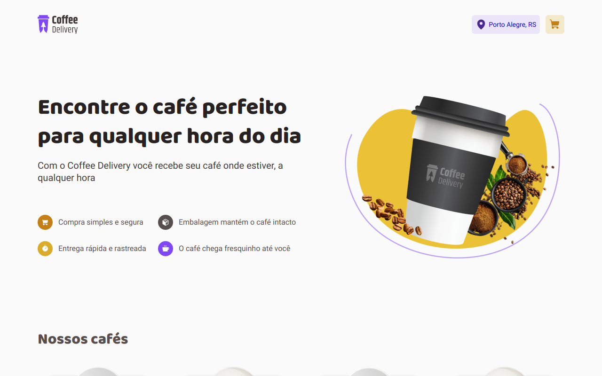

<h1 align="center"> Coffee Delivery </h1>


<div align="center">



</div>

## 📄 Descrição da Aplicação

Essa aplicaçao foi proposta pela <a hrfe="https://www.rocketseat.com.br/" target="_blank">RocketSeat</a> No curso do **Ignite**. 
Durante este desafio, utilizamos conceitos um pouco mais avançados desenvolvendo do zero uma aplicação de encomenda de cafés! A aplicação conta com 3 telas sendo a primeira uma tela de apresentação e também de listagem dos cafés disponíveis. Na segunda tela, o usuário precisa preencher um formulário com seus dados de endereço e ao lado direito é possível visualizar os itens do carrinho, podendo alterar a quantidade ou remover o mesmo. Na terceira e última tela, é exibido uma confirmação do pedido e também os detalhes de entrega da compra.

## 📓 Sobre o desafio
  É uma aplicação para gerenciar um carrinho de compras de uma cafeteria fictícia, que contém as seguintes funcionalidades:

- Listagem de produtos (cafés) disponíveis para compra
- Adicionar uma quantidade específicas de itens no carrinho
- Aumentar ou remover a quantidade de itens no carrinho
- Formulário para o usuário preencher o seu endereço
- Exibir o total de itens no carrinho no Header
- Exibir o valor total da soma de itens no carrinho multiplicados pelo valor

### Habilidades e Tecnologias 💻
 <br />
<details>
  <summary> 🖥️ Habilidades</summary>
  <br />

  - Desenvolvimento de aplicações React
  - Criatividade
  - Metodologia ágil (Scrum) (Kanban)

  <br />
</details>
 <br />
<details>
  <summary> 🖥️ Tecnologias</summary>
    <br />

  - Vite
  - Styled Components
  - Local Storage
  - Typescript
  - Context API
  - React Router Dom
  - React Hook Form
  - Validações de formulário com Zod
  - Styled Components
  - CSS3
  - HTML5
     
</details>
<br />

### 📚 Documentação 📚
<br />
  <details>
    <summary> 🚀 Rodando o projeto</summary>
    <br />

* Faça o fork do repositório:
    Tutorial [AQUI](https://github.com/UNIVALI-LITE/Portugol-Studio/wiki/Fazendo-um-Fork-do-reposit%C3%B3rio)
* Abra seu terminal e navegue até a pasta onde preferir alocar o projeto.

* Clone o repositório:

    ```sh
      git clone git@github.com:JoaoAlberto20/coffeeDelivery.git
    ```

* Apos ter o repositório clonado em sua maquina, execute este comando para acessar a parta do projeto:

    ```sh
      cd coffeeDelivery
    ```

* Dentro da pasta do projeto, execute o comando abaixo para instalar as dependências do projeto:

    Caso utilize o npm:

    ```sh
      npm install
    ```

    Caso utilize o yarn:

    ```sh
      yarn install
    ```

* Dentro da pasta do projeto, execute o comando abaixo para iniciar o servidor do projeto:

    Caso utilize o npm:

    ```sh
      npm run dev
    ```

    Caso utilize o yarn:

    ```sh
      yarn run dev
    ```

  O aplicativo sera executado em modo de desenvolvimento.
  Abrindo na porta padrão que o React usa: <http://localhost:3000/> em seu navegador.

  </details>
<br />